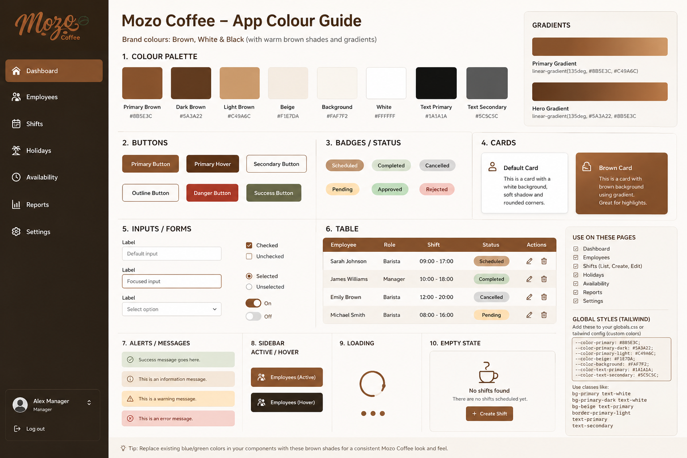

# Phase 1 Testing
# colour scheme: brown, white, black, and warm beige neutrals

## Database Testing
# Testing 1: Add an Employee

Expected Outcome: Employee details that are required or Non-nullable should be entered and saved successfully

Actual Outcome: Employee details that were required were added successfully

# Testing 2: Add Availability

Expected Outcome: Using employee\_id, input necessary fields and it should be referenced and save correctly.

Actual Outcome: Using the employee\_id for Sarah from the employee table, it was referenced correctly and saved successfully.

# Testing 3: Add Shift

Expected Outcome: Using employee\_id for both columns: employee\_id and created\_by, create a new row for the employee, Sarah successfully

Actual Outcome: The row has been successfully created. Note: For the row to be successfully created also add the employee\_id into the created\_by column.

# Testing 4: Try entering an invalid employee

Expected Outcome: The database should throw an error at the invalid employee\_id input

Actual Outcome: the database threw an error at the invalid employee\_id inputted

# Phase 2 - Authentication

Staff login: Email + Password with invite-only accounts (manager adds staff → staff gets invite email).

Testing 5: Is the Page working?

Expected Outcome: Go to http://localhost:3000/login and the input boxes should be shown, consisting of an email text box, password, and a login button

Actual Outcome: The login page is working as expected

# By 14/06/2026 I finished building
✅ database schema
✅ relationships
✅ Supabase Auth login
✅ session handling
✅ employee ↔ auth linking
✅ role-based routing with accompanied tests
✅ manager redirect with accompanied tests
✅ protected loading state with accompanied tests

# Testing 6: Is the Route Guard working?

Expected Outcome 1: Go to http://localhost:3000/dashboard and it should redirect to the login page if not logged in
Expected Outcome 2: If an employee not logged in tries to access http://localhost:3000/admin it should block access and redirect to the login page
Expected Outcome 3: Go to http://localhost:3000/admin and it should show the admin page if logged in as a manager

Actual Outcome 1: The route guard is working as expected, redirecting to the login page if not logged in
Actual Outcome 2: The route guard is working as expected, redirecting to the login page
Actual Outcome 3: The route guard is working as expected, showing the admin page if logged in as a manager

# Testing 7: Is the Logout working?

Expected Outcome: When the logout button is clicked, it should log the user out and redirect to the login page (Both for manager and employee)

Actual Outcome: The logout button is working as expected, logging the user out and redirecting to the login page for both manager and employee

# Testing 8: Is the Employee page in the manager dashboard working?

Expected Outcome: When the manager clicks on the Employee page, it should show a list of employees and a button to add a new employee.

Actual Outcome: The Employee page is working as expected, showing a list of employees and a button to add a new employee.

# Testing 9: Is the Add Employee page in the manager dashboard working?
Expected Outcome: When the manager clicks on the Add Employee button, it should show a form to add a new employee with all the required fields. When the form is submitted, it should add the new employee to the database and redirect back to the Employee page.

Actual Outcome: The app returned: failed to add employee. The error message was that the 'Add Employee' was violating one of the RLS policies. After checking the RLS policies, it was found that the policy did not allow for any insert into the employees table. A new policy was added to strictly allow the manager through authentication to insert a new employee and the test was successful.

# By 16/06/2026 I finished building
✅ Auth system
✅ Role-based routing
✅ Protected pages
✅ Sessions
✅ Admin sidebar
✅ Employee list
✅ Add employee form
✅ Database insert
✅ RLS working

# 16/06/2026
# Testing 10: Is the Employee search working?
Expected Outcome: When the manager types in the search box, it should filter the list of employees based on the search query.

Actual Outcome: The Employee search is working as expected, filtering the list of employees based on the search query.

# Testing 11: Is the Employee edit page working?
Expected Outcome: When the manager clicks on the Edit button for an employee, it should show a form to edit the employee details with all the required fields. When the form is submitted, it should update the employee details in the database and redirect back to the Employee page.

Actual Outcome: The Employee edit page displays as expected, but when the form is submitted, it returned that the 'Update Employee' was null. I added another policy to allow the manager to update the employee details and the test was successful.

# By 21/06/2026 I finished building
✅ Authentication
✅ Role-based access
✅ Protected routes
✅ Employee list
✅ Search
✅ Add employee
✅ Edit employee
✅ Archive employee
✅ Active/Inactive filtering
✅ Contracted hours
✅ Holiday allowance

# Testing 12: Is the Employee archive working?
Expected Outcome: When the manager clicks on the Archive button for an employee, it should show a confirmation dialog. If the manager confirms, it should archive the employee in the database and remove them from the list of employees.

Actual Outcome: The Employee archive is working as expected, showing a confirmation dialog and archiving the employee in the database upon confirmation.

# Testing 13: Is the Employee active/inactive filtering working?
Expected Outcome: When the manager clicks on the Active or Inactive button, it should filter the list of employees based on their status.

Actual Outcome: The Employee active/inactive filtering is working as expected, filtering the list of employees based on their status.

# Testing 14: Is the Employee Profile page working?
Expected Outcome: When the manager clicks on an employee's name, it should show the employee's profile page with all their details.

Actual Outcome: The Employee Profile page is working as expected, showing the employee's profile page with all their details.

# Testing 15: Are the tabs on the Employee Profile page working?
Expected Outcome: When the manager clicks on the Availability, Shifts, and Holiday tabs, it should show the respective information for the employee.

Actual Outcome: The tabs on the Employee Profile page are working as expected, showing the respective information for the employee.

# Testing 16: Is the Add Availability form on the Employee Profile page working?
Expected Outcome: When the manager fills out the Add Availability form and submits it, it should add the availability to the database and show it in the list of availabilities for the employee.

Actual Outcome: The Add Availability form on the Employee Profile page was not working. It said the RLS policy was preventing the insert, but after creating a new policy, it is now working as expected, adding the availability to the database and displaying it in the list of availabilities for the employee.

# Testing 17: Is the Edit Availability form on the Employee Profile page working?
Expected Outcome: When the manager clicks on the Edit button for an availability, it should show come up in the 'Add availability' form with the existing details filled in. When the details are updated and the form is submitted, it should update the availability in the database and show the updated information in the list of availabilities for the employee.

Actual Outcome: The Edit Availability form on the Employee Profile page was not working but it was an RLS policy issue. So I added another policy that enabled authenticated users to edit availabilities. It is now working as expected, showing the existing details filled in, updating the availability in the database upon submission, and displaying the updated information in the list of availabilities for the employee.

22/06/2026 I will start building the Holiday table on Supabase and the app.

# By 24/06/2026 I finished building the Holiday table and creating a dashboard for it
Current Mozo Capabilities:
Authentication
├─ Login
├─ Roles
└─ Protected Routes

Employees
├─ List
├─ Search
├─ Add
├─ Edit
├─ Archive
└─ Profiles

Availability
├─ View
├─ Add
├─ Edit
├─ Delete
└─ Duplicate Prevention

Holidays
├─ Request
├─ Edit
├─ Approve
├─ Reject
├─ History
└─ Balance Calculation

By 30/06/2026 I've built:

Authentication
✅ Login
✅ Role-based routing
✅ Manager / Employee permissions

Employee Management
✅ Employee List
✅ Add Employee
✅ Edit Employee
✅ Archive Employee
✅ Employee Profile

Availability
✅ Add Availability
✅ Edit Availability
✅ Delete Availability
✅ RLS Policies

Holidays
✅ Request Holiday
✅ Approve Holiday
✅ Reject Holiday
✅ Edit Holiday
✅ Holiday Balance
✅ Remaining Allowance

Shift Management
✅ Create Shift
✅ Edit Shift
✅ Delete Shift
✅ Employee Relationship
✅ Shift Table
✅ Component Refactor

Admin
✅ Dashboard
✅ Navigation
✅ Protected Routes

# Testing 18: Is the Shift edit form on the Employee Profile page working?
Expected Outcome: When the manager clicks on the Edit button for a shift, it should show come up in the 'Add shift' form with the existing details filled in. When the details are updated and the form is submitted, it should update the shift in the database and show the updated information in the list of shifts for the employee.

Actual Outcome: The Edit Shift form on the Employee Profile page was working but the 'Select employee' placeholder in the textbox was hidden and when other employees were selected, it did not update correctly. So I fixed the issue with the placeholder by adding an aria-label to the select element and updating the employee selection logic. It is now working as expected, showing the existing details filled in, updating the shift in the database upon submission, and displaying the updated information in the list of shifts for the employee.

### Phase 6 Roadmap
Step 1 ✅ Create the rota page

Step 2 ✅ Week selector

Step 3 ✅ Generate Monday–Sunday

Step 4 ✅ Display employees

Step 5 ✅ Load shifts into cells

Step 6 ✅ Click cell to create shift

Step 7 ✅ Click shift to edit

Step 8 ✅ Availability warnings

Step 9 ✅ Holiday warnings

Step 10 ✅ Publish rota

# Testing 19: Is the Rota page working?
Expected Outcome: When the manager clicks on the Rota page, it should show a week selector and a table with the days of the week as columns and the employees as rows. The shifts should be displayed in the respective cells.

Actual Outcome: The Rota page is working as expected, showing a week selector and a table with the days of the week as columns and the employees as rows. The shifts are displayed in the respective cells. I just modified the colours of the rota page to match the design system colours. The rota page now has a brown gradient for the day headers and a white background for the employee rows. The shifts are displayed in a light beige colour with black text. The availability and holiday warnings are displayed in red and yellow respectively.

02/07/2026
# Testing 20: Is the Rota page shift creation and edit working?
Expected Outcome: When the manager clicks on an empty cell in the rota table, it should show a form to create a new shift with the employee and date pre-filled. When the form is submitted, it should add the new shift to the database and display it in the respective cell. When the manager clicks on an existing shift, it should show a form to edit the shift with the existing details filled in. When the form is submitted, it should update the shift in the database and display the updated information in the respective cell.

Actual Outcome: The Rota page shift creation and edit is working as expected, showing a form to create a new shift with the employee and date pre-filled when an empty cell is clicked. When the form is submitted, it adds the new shift to the database and displays it in the respective cell. When an existing shift is clicked, it shows a form to edit the shift with the existing details filled in. When the form is submitted, it updates the shift in the database and displays the updated information in the respective cell.

📈 My suggested roadmap for Mozo

Phase 6 ✅
Employee Management
Holidays
Availability
Shifts
Weekly Rota

Phase 7
⭐ Employee Portal
⭐ Employee Dashboard
⭐ Manager Dashboard improvements

Phase 8
Announcements
Clock In / Clock Out
PDF Rota Export

Phase 9
Timesheets
Payroll Reports
Email Notifications

Phase 10
Mobile-friendly UI
Push Notifications
Shift Swap Requests
Premium scheduling features

06/07/2026 - Phase 7 - Reusable UI Components

const { employee, loading } = useEmployee()